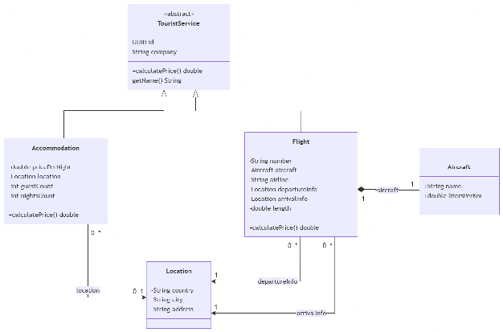
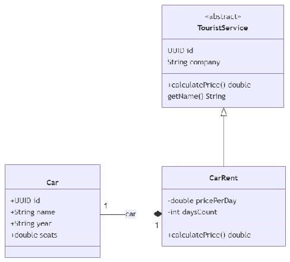

# Desarrollo de Software

## Clase práctica 1

Una empresa de turismo se encuentra en proceso de informatización y ha decidido desarrollar un nuevo sistema para gestionar las reservas de vuelos y alojamientos. En conjunto con una consultora, la empresa ya ha definido el diseño del sistema; sin embargo, ahora necesita llevar a cabo su implementación, para lo cual ha contratado sus servicios. En función del diseño establecido, deberá implementar las clases, interfaces, métodos y demás componentes necesarios para el correcto funcionamiento del sistema.

1. Utilice el diagrama de clases para implementar las clases de dominio y sus relaciones entre sí

2. Incorpore una nueva interfaz llamada **Identifiable** con el método getId() y haga que todas las clases del dominio la implementen.

3. Añada una nueva subclase de **TouristService** llamada **CarRent** para representar instancias de alquileres de autos e implemente el método calculatePrice() que devuelva el ***precio por dia \* días alquilados \* cantidad de asientos del auto***.

4. En el método **main** de la clase **Main**, instancie un alojamiento, un vuelo, dos location y genere una lista que permita posteriormente iterar sobre ellos e **imprimir** el id de cada uno.

5. En el método **main** de la clase **Main** cree un objeto de la clase **CarRent** y genere una nueva lista junto con las instancias del alojamiento y el vuelo creados anteriormente.

6. En **Main** Implemente un nuevo método de clase *sortByPrice()* el cual reciba una lista de servicios turísticos y ordene la misma de mayor a menor según el precio de cada servicio.

7. Desde el método main invoque el método *sortByPrice* pasando como parámetro la lista generada en el punto 5 e imprima los resultados obtenidos (mostrando el id del servicio y el precio de cada uno).

8. Utilizando los setters de la clase **Flight**, actualice la longitud del vuelo creado previamente accediendo al mismo desde la lista ordenada e imprima los datos asociados al mismo. Luego, acceda al vuelo desde la lista que posee los *Identifiables*, imprima los datos asociados y observe los resultados. ¿Por qué se actualiza la longitud de ambos?

   
