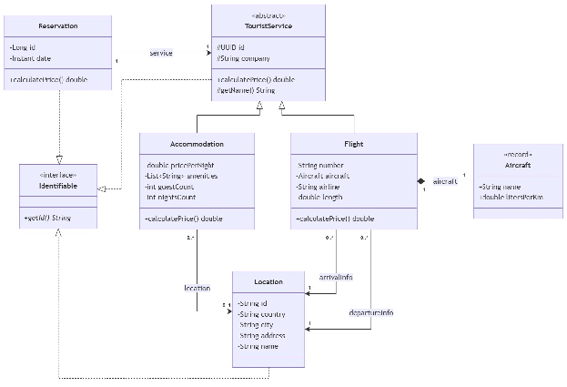

# Desarrollo de Software

## Clase práctica 2

Una empresa de turismo, la misma del sistema que viene desarrollando, quiere extender su plataforma para persistir las reservas de vuelos y cargar sus usuarios desde archivos. Partiendo del diseño implementado en la clase anterior,  su trabajo consistirá en desarrollar los métodos necesarios para que el sistema permita gestionar usuarios y reservas de vuelos respondiendo correctamente ante distintas situaciones de error.



Considerando que:

- Se desean almacenar reservas a vuelos en un archivo **reservations.csv** con el siguiente formato:

  ```
  <reservationId>,<serviceId>,<ownerId>,<date>
  ```

- Se posee un archivo **users.txt** que en cada línea el id del usuario seguido de su nombre de usuario, separados por un espacio:

  ```
  550e8400-e29b-41d4-a716-446655440000 juan
  f47ac10b-58cc-4372-a567-0e02b2c3d479 maria
  ```

1. Agregue al dominio la clase User con los atributos **id** (UUID), **username** (String), **name** (String) y **address** (Location). Esta clase debe implementar la interfaz **Identifiable**.

2. Implemente la excepción **UserNotFoundException** (que obligue a ser capturada). El constructor debe recibir el nombre de usuario que no fue encontrado e incluirlo en el mensaje de error.

3. Implemente el método **loadUser()** en la clase **MainClase2**. El método debe:

   1. Pedir al usuario que ingrese un nombre de usuario por consola.

   2. Abrir el archivo **users.txt** y leer línea por línea para buscar la que contenga el nombre ingresado (importante que sea case-insensitive).

      1. Si lo encuentra, retorna el objeto User correspondiente.

      2. Si no lo encuentra, se debe lanzar una UserNotFoundException.

   3. Si el archivo no existe u ocurre algún error en la lectura, se debe wrappear la excepción en una RuntimeException customizada.

4. Implemente el método **saveFlightReservation()** el cual debe tomar una **Reservation** y almacenarla en el archivo reservations.csv. Es importante que la reserva a guardar no pise las posibles reservas que ya existan en el archivo.

   1. Se debe imprimir "Reserva guardada" en caso de que la operación sea exitosa, o "No se pudo guardar la reserva" ante lo contrario.

5. Implemente en una nueva clase llamada MainClase2 un método main que:

   1. Construya un objeto Flight con un Aircraft configurado

   2. Invoque a **loadUser()** para obtener un usuario.

   3. Consulte al usuario por consola "Que acción desea realizar?". Si el usuario ingresa "Reservar" continuamos con este flujo. Caso contrario se debe terminar la ejecución sin guardar.

   4. Cree una **Reservation** con un ID aleatorio, el vuelo, el usuario y la fecha/hora actual.

   5. Invoque a **saveFlightReservation(reservation)** para persistir la reserva.

* En caso de que no se encuentre un usuario, deberá imprimir *"Usuario no encontrado"*

* Ante cualquier error inesperado del sistema se deberá imprimir *"Error en el sistema"* y finalizar la ejecución.

6. Analice el flujo de excepciones del método main():

   1. ¿Qué ocurre si el archivo users.txt no existe? ¿Qué bloque catch lo atrapa y por qué?

   2. ¿Qué alternativa podría aplicar si no desea capturar **FileNotFoundException** e **IOException** dentro de **loadUser()**? Implementarla y observe las diferencias

7. Implemente la funcionalidad **listar reservas**. Para esto:

   1. Agregue una nueva acción posible para el usuario "Ver reservas".

   2. Si el usuario ingresa esta opción, se deben buscar las reservas asociadas al usuario guardadas en **reservations.csv** y mostrar sus datos en la consola.

8. Suponga que se desea almacenar los servicios turísticos en un nuevo archivo **touristServices.csv**. ¿Qué alternativas existirían? Implemente la que le parezca más apropiada.
